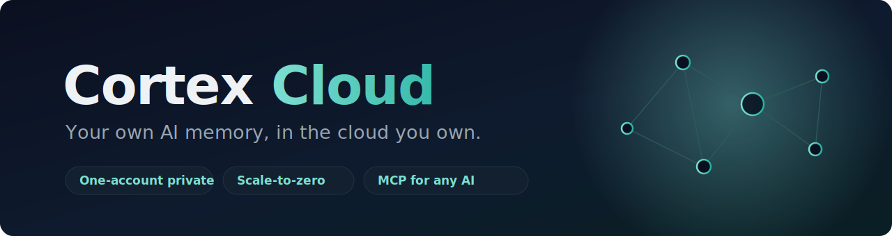

<p align="center">
  
</p>

<p align="center">
  <strong>Your own AI memory, in the cloud you own.</strong><br>
  Deploy a private, single-owner AI memory service to Azure in about 15 minutes.
</p>

<p align="center">
  <a href="LICENSE"></a>
  
  
  
  
  
</p>

---

**Cortex Cloud** turns [Cortex](https://github.com/turfptax/cortex-core), a personal
AI memory engine, into a private website. Sign in with your Microsoft account and your
entire memory corpus becomes a URL: searchable from any browser or phone, and readable
by your AI assistants (Claude, ChatGPT, Grok) over the [Model Context
Protocol](https://modelcontextprotocol.io). It is one Azure Container App that scales to
zero, so at rest it costs a few dollars a month, and it is locked to exactly one person:
you.

> No shared servers, no multi-tenant database, no vendor lock-in. Your corpus, your keys,
> your Azure subscription, your bill. Clone this repo and you own the whole stack.

## Why

Most "AI memory" products keep your data on their servers and read it on their terms.
Cortex Cloud flips that: the memory lives in **your** cloud, gated by **your** identity
provider, and your AI tools connect to it as a first-class source rather than a scrape.
It is small enough to understand end to end and cheap enough to leave running.

|  |  |
|---|---|
| 🔒 **Single-owner by design** | Sign-in is locked to one Microsoft account. Others in your tenant cannot even get a session, and every API call is pinned to your identity. |
| 💤 **Scale-to-zero economics** | The app sleeps when idle and wakes on the first request. Roughly $7 to $9 a month, most of it just the registry and storage. |
| 🧠 **Semantic recall built in** | An embedding server ships in the same image, so search understands meaning, not just keywords. |
| 🔌 **MCP for any AI** | Claude, ChatGPT, and Grok connect over OAuth 2.1 + PKCE, read-only and default-deny until you grant access. |
| 📱 **Any device** | A responsive web Hub, served from the same container, works from your desktop or your phone. No install. |
| 🗃️ **SQLite + Litestream** | The corpus is a plain SQLite file, continuously replicated to Blob storage and restored on cold start. No database server to run or pay for. |

## Quickstart

You need an Azure subscription, a Microsoft account, and an
[OpenRouter](https://openrouter.ai/keys) API key.

```bash
git clone https://github.com/turfptax/Cortex-Cloud.git
cd Cortex-Cloud
cp .env.example .env      # add your subscription, a unique suffix, your OWNER_OID, your key
#                           OWNER_OID:  az ad signed-in-user show --query id -o tsv

bash deploy/deploy.sh     # provisions everything, prints your URL
bash deploy/tick-job.sh   # schedules the memory loop
```

Open the printed URL, sign in with Microsoft, and you have an empty corpus ready to fill.
`deploy.sh` creates the resource group, registry, storage, Key Vault, the Entra app
(locked to you), builds the image from source, and deploys the Container App with
Microsoft sign-in wired up.

> **Run it once in a throwaway resource group first.** These scripts codify the exact
> sequence used to stand up the reference instance, and the README walks each of the nine
> steps. WSL, macOS, or Azure Cloud Shell give the smoothest `az` experience.

## Architecture

One Container App, four containers off a single image, sharing an ephemeral volume.
Only the gateway is public.

```
                 you (browser / phone)          AI assistants
                        |  Microsoft login          |  OAuth 2.1 + MCP
                        v                            v
        +--------------------------------------------------+
        |  gateway  :8430  (public)                        |
        |   /  SPA    /api facade    /oauth   /mcp   /ops   |
        +----------------------+---------------------------+
                        | localhost (service token)
        +---------------v-----------+   +--------------+
        |  core :8420 (private)     |-->|  embed :8082 |
        |  SQLite corpus + loop     |   +--------------+
        +---------------+-----------+
                        | litestream (continuous)
                   +----v----+
                   |  Blob   |   restored on cold start
                   +---------+
```

| Container | Role |
|-----------|------|
| **core** | the memory engine and interpretive loop; the only writer of the corpus |
| **gateway** | public ingress: the `/api` facade, the web Hub, the OAuth 2.1 server, the MCP endpoint |
| **embed** | a small llama.cpp server for semantic recall |
| **litestream** | streams the SQLite databases to Blob storage while the app is warm |
| *init:* **restore** | restores the databases from Blob on cold start, before the writer starts |

The gateway forwards browser requests to the co-located core with a service token
injected server-side, so the browser never holds a corpus credential. Its session is your
Microsoft sign-in, and nothing else.

## Security model

- **Sign-in is locked to one account.** The Entra app is single-tenant with
  `appRoleAssignmentRequired` on and only you assigned, so Microsoft refuses to issue a
  session to anyone else before any application code runs.
- **Owner pin in the app.** Every `/api` request is additionally checked against your
  Entra object id. A stray session gets 403, never the corpus.
- **Secrets never touch the repo.** The LLM key lives in Key Vault; the internal service
  token and storage key are Container App secrets. The image build refuses to stage any
  database or identity file, and this repo ships with none.
- **Connectors are least-privilege.** AI assistants authorize over OAuth 2.1 with PKCE,
  start with no access, and are read-only unless you opt in.

## What you get

Cortex organizes what it remembers into five pillars, and the goal is for every one of
them to be reachable both in the web Hub and over MCP, so any AI you connect can use them:

| Pillar | What it holds |
|---|---|
| **Memory** | your corpus: searchable by meaning and by keyword, layered from summaries down to raw source |
| **Projects** | what you are working on, rolled up over time |
| **People** | your contacts and the interactions with them |
| **Rules** | the hard-won defaults you want every AI to respect |
| **Skills** | a living record of how you do things |

Three engines keep it alive: an **Overseer** that curates memory in the background, a
**Lemon Squeezer** that turns your interactions into durable lessons, and **Simples**, a
planner that turns goals into time blocks. A copy-context page at `/intro` hands a portable
brief to any AI that is not connected.

Today the MCP surface exposes Memory (search, read, recent, ingest); the pillars and
planning are becoming first-class MCP tools next. See [docs/VISION.md](docs/VISION.md).

## Repo layout

```
cortex_gateway/     the FastAPI gateway (OAuth server, /api facade, MCP, SPA serving)
deploy/             infrastructure as code plus the deploy scripts
  containerapp.tmpl.yaml   the four-container app, parameterized
  deploy.sh                one-shot provision and deploy
  entra-setup.sh           the Microsoft sign-in app, locked to you
  build-image.sh           build the combined image from source
  tick-job.sh              schedule the memory loop
docs/               the OAuth flow, connector-grant model, and Entra setup
tests/              the gateway test suite (pytest)
```

## FAQ

**Is my data sent anywhere?** Only to the LLM you choose (via OpenRouter) for the memory
loop, and to your AI assistants when you explicitly grant them access. The corpus lives in
your Azure storage.

**Can I use a different LLM?** Yes. The engine talks to OpenRouter, so any model it offers
works. Swap the key and the model name.

**Do I need a custom domain?** No. You get an `azurecontainerapps.io` URL for free. A
custom domain is a few DNS records if you want one.

**Can I self-host without Azure?** The engine ([cortex-core](https://github.com/turfptax/cortex-core))
runs anywhere Python does; this repo is the Azure cloud path specifically. A Cloudflare
Tunnel config for a home-server deployment is included under `deploy/`.

## Related

- [cortex-core](https://github.com/turfptax/cortex-core) is the memory engine that runs as the `core` container.
- [cortex-desktop](https://github.com/turfptax/cortex-desktop) is the local Hub and the web UI source that ships in the `gateway` container.

## Contributing

Issues and pull requests are welcome. The gateway suite runs with `pytest`; please keep it
green. If you deploy your own instance, a note on what tripped you up is genuinely useful.

## License

[MIT](LICENSE). Build your own memory. Own it.
